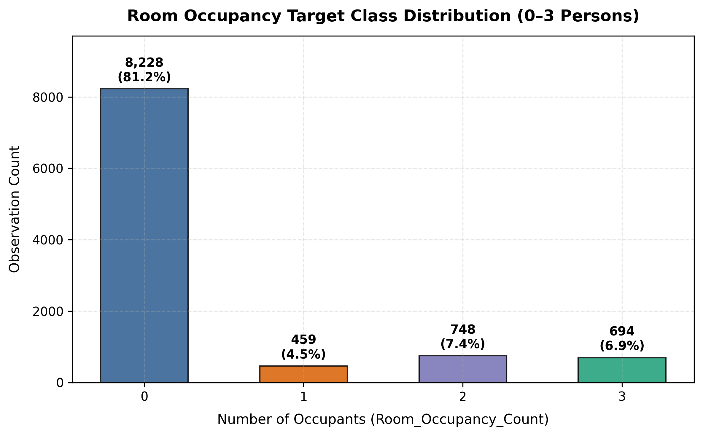
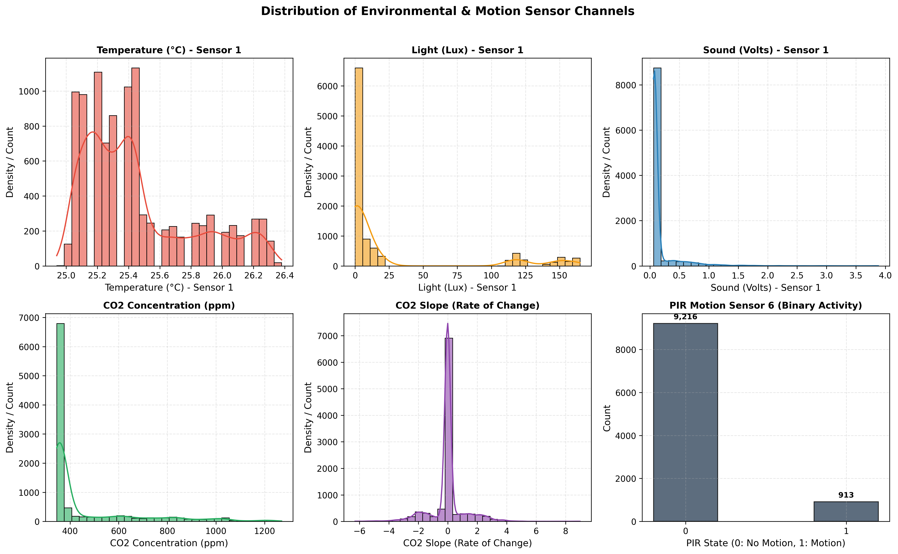
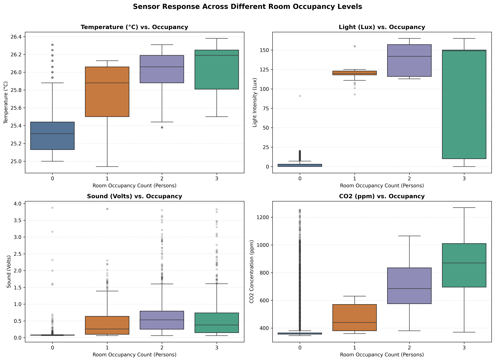
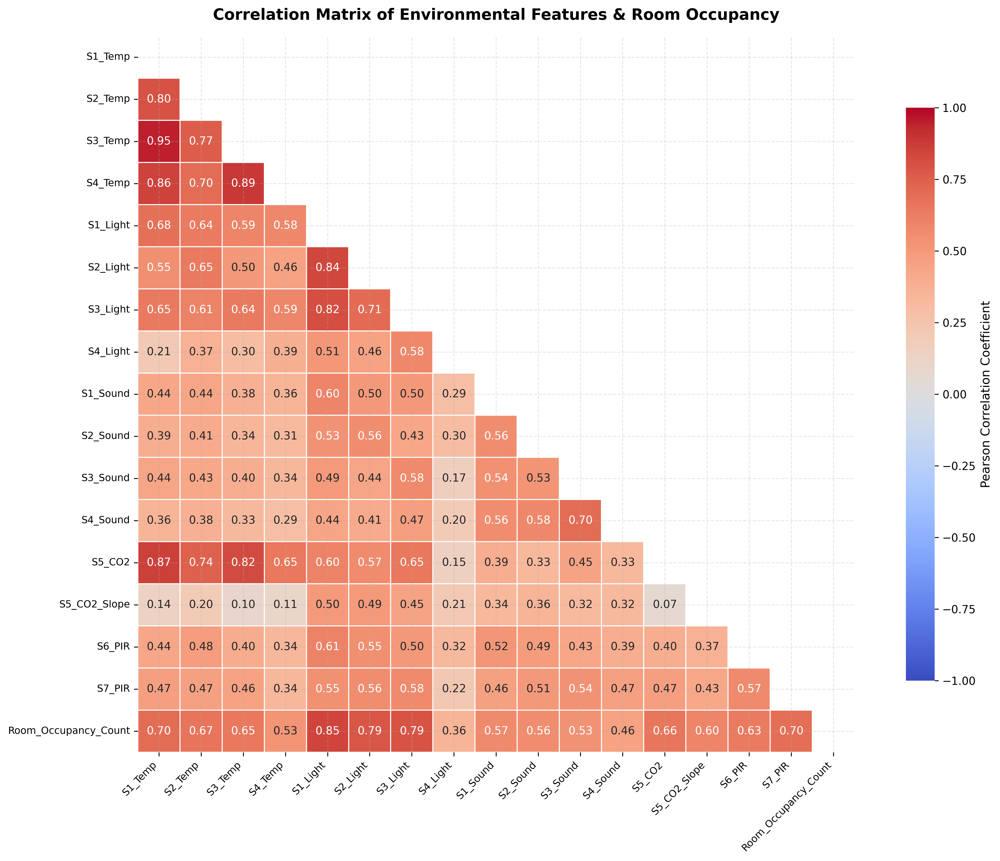
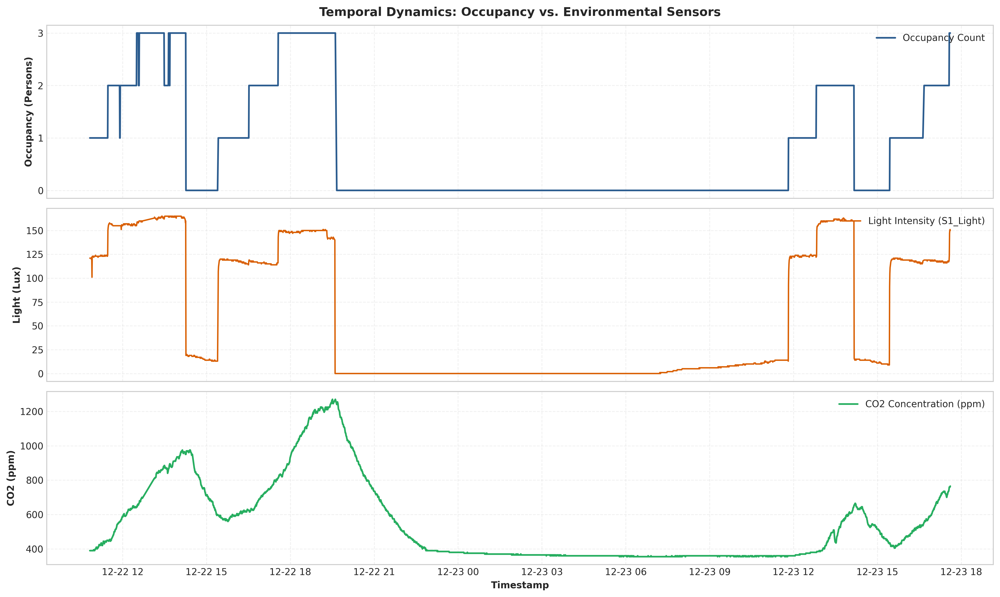
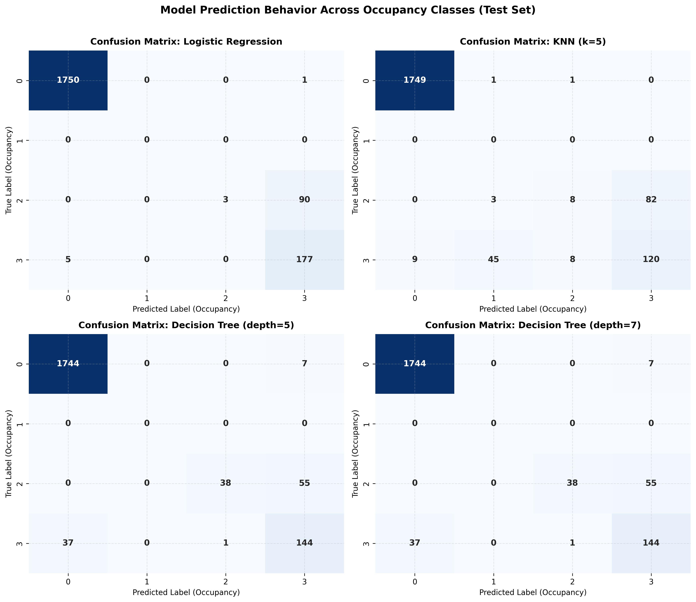
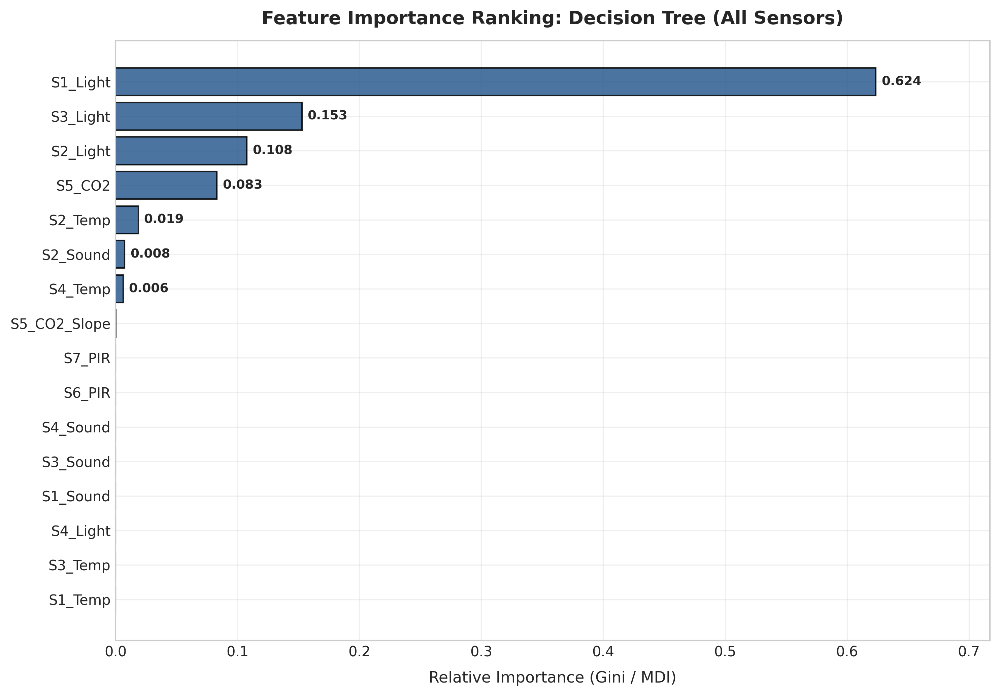
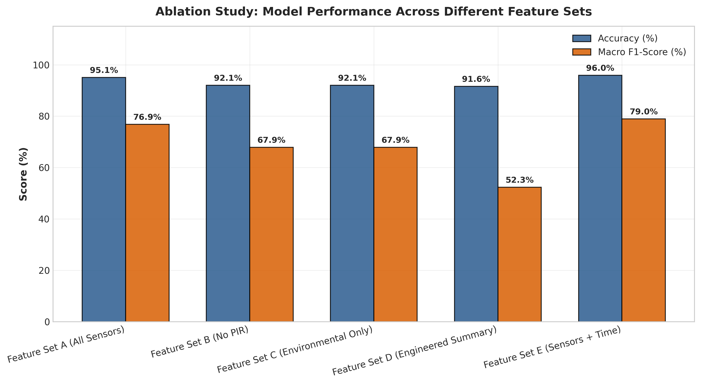
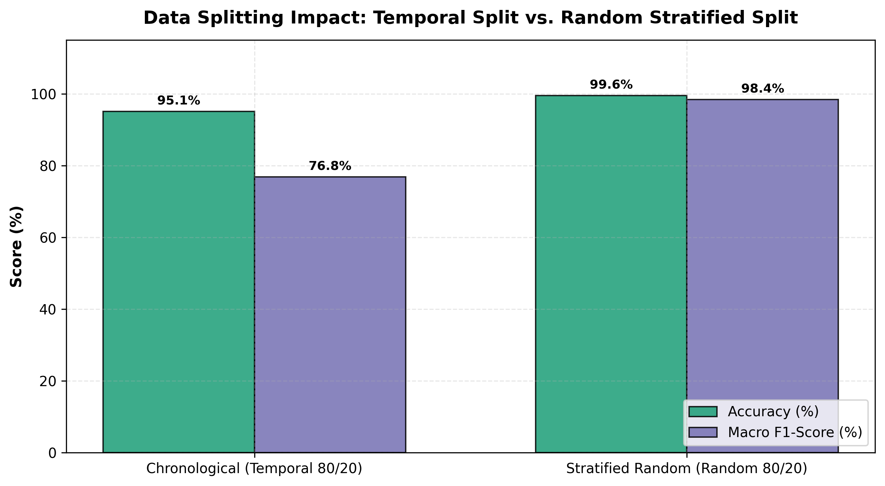

# 🏢 Room Occupancy Estimation Using Environmental Sensors

[](https://www.python.org/)
[](https://scikit-learn.org/)
[](LICENSE)
[](https://github.com/gdnz1/room_occupancy_estimation)

> **An End-to-End Machine Learning & Portfolio Project** estimating room occupancy count ($0, 1, 2, 3$ persons) from ambient environmental sensors (Temperature, Light, Sound, $\text{CO}_2$, $\text{CO}_2$ Slope, and PIR Motion sensors).

---

## 📌 Project Overview & Research Question

In smart buildings and IoT automation, knowing occupancy count is essential for HVAC optimization and energy conservation without invasive surveillance (cameras/microphones).

**Core Research Question:**
> *"To what extent can ambient environmental sensors accurately estimate room occupancy, and can passive or aggregated sensor features achieve comparable performance with fewer sensors?"*

---

## 📁 Repository Structure

```text
room_occupancy_estimation/
├── data/
│   ├── raw/
│   │   └── Occupancy_Estimation.csv       # Original UCI dataset (10,129 rows, 19 cols)
│   └── processed/
│       ├── train_temporal.csv             # Chronological 80% train split (8,103 rows)
│       ├── test_temporal.csv              # Chronological 20% test split (2,026 rows)
│       └── engineered_features.csv        # Dataset with spatial aggregations & time features
├── notebooks/
│   └── room_occupancy_analysis.ipynb      # Complete, interactive & reproducible analysis notebook
├── src/
│   ├── __init__.py
│   ├── config.py                          # Constants, file paths, feature sets, seeds
│   ├── data_loader.py                     # Data loading, quality inspection, temporal splits
│   ├── feature_engineering.py             # Spatial mean/range and temporal features
│   ├── models.py                          # Scikit-learn Pipeline factories (LR, KNN, Decision Tree)
│   ├── evaluate.py                        # Model training, evaluation & metrics export
│   └── visualization.py                   # 300 DPI publication-quality plotting routines
├── outputs/
│   ├── figures/                           # 9 high-resolution PNG figures
│   ├── metrics/                           # CSV performance and ablation tables
│   └── models/                            # Serialized trained models (.joblib)
├── medium_article.md                      # Publication-ready Medium article draft (Turkish)
├── README.md                              # Project documentation
├── requirements.txt                       # Minimal required packages
└── .gitignore
```

---

## 🚀 Installation & Usage

### 1. Clone Repository & Install Dependencies
```bash
git clone https://github.com/gdnz1/room_occupancy_estimation.git
cd room_occupancy_estimation
pip install -r requirements.txt
```

### 2. Run Quality Checks & EDA Figures
```bash
python -m src.data_loader
python -m src.visualization
```

### 3. Run Feature Engineering & Train Pipelines
```bash
python -m src.feature_engineering
python -m src.evaluate
```

### 4. Interactive Jupyter Notebook
```bash
jupyter notebook notebooks/room_occupancy_analysis.ipynb
```

---

## 🔬 Methodological Highlights

1. **Strict Chronological (Temporal) Split:** Data sampled at ~31-second intervals suffers from temporal data leakage under random splitting. The primary benchmark strictly uses the first 80% chronologically for training and the last 20% for testing.
2. **Zero-Leakage Pipelines:** Feature scaling (`StandardScaler`) is enclosed within Scikit-learn `Pipeline` objects, fitting strictly on training splits.
3. **Multiclass Evaluation:** Evaluated with Accuracy, Macro Precision, Macro Recall, Macro F1, Weighted F1, and Confusion Matrices.

---

## 📊 Experimental Results

### 1. Benchmark Algorithm Comparison (Feature Set A - 16 Sensors)

| Model | Test Accuracy | Macro Precision | Macro Recall | Macro F1-Score | Weighted F1-Score |
| :--- | :---: | :---: | :---: | :---: | :---: |
| **Decision Tree ($\text{depth}=5$)** | **95.06%** | **88.42%** | **73.19%** | **76.85%** | **94.66%** |
| **Decision Tree ($\text{depth}=7$)** | 95.06% | 88.42% | 73.19% | 76.85% | 94.66% |
| **Logistic Regression** | 95.26% | 88.59% | 66.81% | 61.58% | 93.63% |
| **Decision Tree ($\text{depth}=3$)** | 92.05% | 83.24% | 61.04% | 67.85% | 90.94% |
| **KNN ($k=3$)** | 93.48% | 55.90% | 46.34% | 46.85% | 93.08% |
| **KNN ($k=5$)** | 92.65% | 51.49% | 43.61% | 44.18% | 92.44% |
| **KNN ($k=7$)** | 91.41% | 44.77% | 40.43% | 41.83% | 91.52% |

### 2. Feature Set Ablation Study (Decision Tree $\text{depth}=5$)

| Feature Set | Features | Accuracy | Macro F1 | Weighted F1 | Key Finding |
| :--- | :---: | :---: | :---: | :---: | :--- |
| **Set A (All Sensors)** | 16 | 95.06% | **76.85%** | 94.66% | Baseline performance |
| **Set B (No PIR)** | 14 | 92.05% | **67.85%** | 90.94% | Removing PIR drops Macro F1 by **9.0%** |
| **Set C (Environmental Only)** | 14 | 92.05% | **67.85%** | 90.94% | Passive sensors alone |
| **Set D (Engineered Summary)** | 10 | 91.61% | **52.34%** | 89.91% | Reduces 16 $\rightarrow$ 10 features, preserves accuracy |
| **Set E (Sensors + Time)** | 19 | **95.95%** | **78.98%** | **95.62%** | Adding time context yields highest overall score |

### 3. Quantifying Temporal Leakage (Split Strategy Impact)

| Split Strategy | Test Accuracy | Macro F1 | Note |
| :--- | :---: | :---: | :--- |
| **Chronological (Temporal 80/20)** | **95.06%** | **76.85%** | **Realistic generalization** (predicting future from past) |
| **Stratified Random (Random 80/20)** | **99.56%** | **98.37%** | **Artificially inflated** due to leakage between 31s steps |

---

## 📈 Visualizations

| Figure | Preview |
| :--- | :--- |
| **1. Target Class Distribution** |  |
| **2. Sensor Distributions** |  |
| **3. Sensor vs. Occupancy Boxplots** |  |
| **4. Correlation Matrix Heatmap** |  |
| **5. Temporal Dynamics** |  |
| **6. Confusion Matrices** |  |
| **7. Feature Importance Ranking** |  |
| **8. Feature Set Ablation Study** |  |
| **9. Temporal vs. Random Split** |  |

---

## ⚠️ Limitations & Future Work

* **Single Environment:** Data was recorded in a single controlled room. Cross-building validation is required for real-world deployment.
* **Occupancy Range:** Current scope covers 0–3 persons.
* **Future Work:** Evaluating recurrent time-series architectures (e.g. LSTM/GRU) and testing multi-room transfer learning.

---

## 📝 Medium Article

A full Turkish publication draft is available at [`medium_article.md`](medium_article.md).

---

## 📜 License
This project is licensed under the MIT License - see the [LICENSE](LICENSE) file for details.
